Difana Nanda Pridhasila Zein

2110131220017

# **1. Komponen Sistem Operasi**

<b>Sistem Operasi</b> merupakan sebuah perangkat lunak yang "membungkus" perangkat keras agar lebih mudah dimanfaatkan oleh para pengguna melalui program-program aplikasi tersebut. <b>Sistem Operasi</b> bertugas untuk mengendalikan (kontrol) serta mengkoordinasikan pengunaan perangkat keras untuk berbagai program aplikasi untuk bermacam-macam pengguna.
Dari sudut pandang pengguna, <b>Sistem Operasi</b> berfungsi sebagai alat untuk mempermudah penggunaan komputer. 
Dari sudut pandang sistem, <b>Sistem Operasi</b> dapat dianggap sebagai alat yang menempatkan sumber-daya secara efisien (Resource Allocator). 

Sebuah sistem operasi dapat dibagi menjadi beberapa komponen. Secara umum, para pakar sepakat bahwa terdapat sekurangnya empat komponen manajeman utama yaitu: 
<li> Manajemen Proses</li>
<li> Manajemen Memori</li>
<li> Manajamen Sistem Berkas</li>
<li> Manajemen Masukan/Keluaran</li>

Selain keempat komponen di atas, Avi Silberschatz, dan kawan-kawan menambahkan beberapa komponen seperti: 
<li> Manajemen Penyimpanan Sekunder.</li>
<li> Manajemen Sistem Proteksi.</li>
<li> Manajemen Jaringan.</li>
<li> Command-Interpreter System.</li>

## **Manajemen Proses**

Sistem operasi bertanggung-jawab atas aktivitas-aktivitas yang berkaitan dengan manajemen proses seperti: 
<li>Membuat dan menghapus proses pengguna dan sistem proses.</li>
<li>Menunda atau melanjutkan proses.</li> 
<li>Menyediakan mekanisme untuk sinkronisasi proses.</li> 
<li>Menyediakan mekanisme untuk komunikasi proses.</li> 
<li>Menyediakan mekanisme untuk penanganan deadlock.</li>

## **Manajemen Memori**

Memori utama atau lebih dikenal sebagai memori adalah sebuah array yang besar dari word atau byte, yang ukurannya mencapai ratusan, ribuan, atau bahkan jutaan. 
Setiap word atau byte mempunyai alamat tersendiri. <b>Memori utama</b> berfungsi sebagai tempat penyimpanan instruksi/data yang akses datanya digunakan oleh CPU dan perangkat Masukan/Keluaran. <b>Memori utama</b> termasuk tempat penyimpanan data yang yang <b>bersifat volatile</b> -- tidak permanen -- yaitu data akan hilang kalau komputer dimatikan.

Sistem operasi bertanggung-jawab atas aktivitas-aktivitas yang berkaitan dengan manajemen memori seperti: 
<li>Menjaga track dari memori yang sedang digunakan dan siapa yang menggunakannya.</li> 
<li>Memilih program yang akan di-load ke memori.</li>

## **Manajemen Sistem Berkas**

<b>Berkas</b> adalah kumpulan informasi yang berhubungan, sesuai dengan tujuan pembuat berkas tersebut. 
Umumnya berkas merepresentasikan program dan data. Berkas dapatmempunyai struktur yang bersifat hirarkis (direktori, volume, dll.).
Sistem operasi mengimplementasikan konsep abstrak dari berkas dengan mengatur media penyimpanan massa, misalnya tapes dan disk.

Sistem operasi bertanggung-jawab dalam aktivitas yang berhubungan dengan manajemen berkas: 
<li> Pembuatan dan penghapusan berkas.</li> 
<li> Pembuatan dan penghapusan direktori.</li>
<li> Mendukung manipulasi berkas dan direktori.</li>
<li> Memetakan berkas ke secondary-storage.</li> 
<li> Mem-back-up berkas ke media penyimpanan yang permanen (non-volatile).</li>

## **Manajemen Sistem Masukan/Keluaran**

Sistem ini sering disebut dengan <b>device manager</b>. Menyediakan device driver yang umum sehingga operasi Masukan/Keluaran dapat seragam (membuka, membaca, menulis, menutup). 
Contoh: pengguna menggunakan operasi yang sama untuk membaca berkas pada perangkat keras, CD-ROM dan floppy disk.

Komponen Sistem Operasi untuk sistem Masukan/Keluaran: 
<li> Penyangga: menampung sementara data dari/ke perangkat Masukan/Keluaran.</li> 
<li>Spooling: melakukan penjadwalan pemakaian Masukan/Keluaran sistem supaya lebih efisien (antrian dsb.).</li> 
<li>Menyediakan driver: untuk dapat melakukan operasi rinci untuk perangkat keras  Masukan/Keluaran tertentu.</li>
 

## **Manajemen Penyimpanan Sekunder**

Data yang disimpan dalam memori utama bersifat sementara dan jumlahnya sangat kecil. Oleh karena itu, untuk menyimpan keseluruhan data dan program komputer dibutuhkan penyimpanan sekunder yang bersifat permanen dan mampu menampung banyak data, sebagai back-up dari memori utama.
Contoh dari penyimpanan sekunder adalah hard-disk, disket, dll.

Sistem operasi bertanggung-jawab atas aktivitas-aktivitas yang berkaitan dengan manajemen disk seperti: 
<li> free space management.</li>
<li> alokasi penyimpanan.</li>
<li> penjadwalan disk.</li>

## **Sistem Proteksi**

Proteksi mengacu pada mekanisme untuk mengontrol akses yang dilakukan oleh program, prosesor, atau pengguna ke sistem sumber daya. Mekanisme proteksi harus: 
<li> Membedakan antara penggunaan yang sudah diberi izin dan yang belum.</li> 
<li> Menspesifikasi kontrol untuk dibebankan/diberi tugas.</li> 
<li> Menyediakan alat untuk pemberlakuan sistem.</li>
 

## **Jaringan**

Sistem terdistribusi adalah sekumpulan prosesor yang tidak berbagi memori, atau clock. Setiap prosesor mempunyai memori dan clock tersendiri. Prosesor-prosesor tersebut terhubung melalui jaringan komunikasi Sistem terdistribusi menyediakan akses pengguna ke bermacam sumber-daya sistem. Akses tersebut menyebabkan peningkatan kecepatan komputasi dan meningkatkan kemampuan penyediaan data.

## **Command Interpreter System**

Sistem Operasi menunggu instruksi dari pengguna (command driven). Program yang membaca instruksi dan mengartikan control statements umumnya disebut: control-card interpreter, command-line interpreter dan terkadang dikenal sebagai shell.
 

<b>Command-Interpreter System</b> sangat bervariasi dari satu sistem operasi ke sistem operasi yang lain dan disesuaikan dengan tujuan dan teknologi perangkat Masukan/Keluaran yang ada. Contohnya: CLI, Windows, Pen-based (touch), dan lain-lain.

# **2. Layanan Sistem Operasi**

Layanan sistem operasi dirancang untuk membuat pemrograman menjadi lebih mudah.
 

- <b>Pembuatan Program:</b> 

Sistem operasi menyediakan berbagai fasilitas yang membantu programer dalam membuat program seperti editor. Walaupun bukan bagian dari sistem operasi, tapi layanan ini diakses melalui sistem operasi.

- <b>Eksekusi Program :</b> 

Sistem harus bisa me-load program ke memori, dan menjalankan program tersebut. Program harus bisa menghentikan pengeksekusiannya baik secara normal maupun tidak (ada error).

- <b> Operasi Masukan/Keluaran</b>. 

Program yang sedang dijalankan kadang kala membutuhkan Masukan/Keluaran. Untuk efisiensi dan keamanan, pengguna biasanya tidak bisa mengatur peranti Masukan/Keluaran secara langsung, untuk itulah sistem operasi harus menyediakan mekanisme dalam melakukan operasi Masukan/Keluaran.

- <b>Manipulasi Sistem Berkas</b>. 

Program harus membaca dan menulis berkas, dan kadang kala juga harus membuat dan menghapus berkas.

- <b>Komunikasi</b>. 

Kadang kala sebuah proses memerlukan informasi dari proses yang lain. Ada dua cara umum dimana komunikasi dapat dilakukan. Komunikasi dapat terjadi antara proses dalam satu komputer, atau antara proses yang berada dalam komputer yang berbeda, tetapi dihubungkan oleh jaringan komputer. Komunikasi dapat dilakukan dengan share-memory atau message-passing, dimana sejumlah informasi dipindahkan antara proses oleh sistem operasi.

- <b>Deteksi Error</b>. 

Sistem operasi harus selalu waspada terhadap kemungkinan error. Error dapat terjadi di CPU dan memori perangkat keras, Masukan/Keluaran, dan di dalam program yang dijalankan pengguna. Untuk setiap jenis error sistem operasi harus bisa mengambil langkah yang tepat untuk mempertahankan jalannya proses komputasi. Misalnya dengan menghentikan jalannya program, mencoba kembali melakukan operasi yang dijalankan, atau melaporkan kesalahan yang terjadi agar pengguna dapat mengambil langkah selanjutnya.

## **Layanan Sistem Operasi : Mempertahankan Efisiensi Sistem**

<li><b>Alokasi Sumber Daya</b>. 

Ketika beberapa pengguna menggunakan sistem atau beberapa program dijalankan secara bersamaan, sumber daya harus dialokasikan bagi masing-masing pengguna dan program tersebut.</li>
 
<li><b>Accounting</b>. 

Kita menginginkan agar jumlah pengguna yang menggunakan sumber daya, dan jenis sumber daya yang digunakan selalu terjaga. Untuk itu maka diperlukan suatu perhitungan dan statistik. Perhitungan ini diperlukan bagi seseorang yang ingin merubah konfigurasi sistem untuk meningkatkan pelayanan.</li>

<li><b>Proteksi</b>. 

Layanan proteksi memastikan bahwa segala akses ke sumber daya terkontrol. Dan tentu saja keamanan terhadap gangguan dari luar sistem tersebut. Keamanan bisa saja dilakukan dengan terlebih dahulu mengidentifikasi pengguna. Ini bisa dilakukan dengan meminta password bila ingin menggunakan sumber daya.</li>

## **System Program**

System program menyediakan lingkungan yang memungkinkan pengembangan program dan eksekusi berjalan dengan baik. Dapat dikategorikan:

- <b>Manajemen/manipulasi berkas</b>. Membuat, menghapus, copy, rename, print, memanipulasi berkas dan direktori.
- <b>Informasi status</b>. Beberapa program meminta informasi tentang tanggal, jam, jumlah memori dan disk yang tersedia, jumlah pengguna dan informasi lain yang sejenis.
- <b>Modifikasi berkas</b>. Membuat berkas dan memodifikasi isi berkas yang disimpan pada disk atau tape. 
- <b>Pendukung bahasa pemrograman</b>. Kadang kala kompilator, assembler, interpreter dari bahasa pemrograman diberikan kepada pengguna dengan bantuan sistem operasi. 
- <b>Loading dan eksekusi program</b>. Ketika program di-assembly atau dikompilasi, program tersebut harus di-load ke dalam memori untuk dieksekusi. Untuk itu sistem harus menyediakan absolute loaders, relocatable loaders, linkage editors, dan overlay loaders. 
- <b>Komunikasi</b> Menyediakan mekanisme komunikasi antara proses, pengguna, dan sistem komputer yang berbeda. Sehingga pengguna bisa mengirim pesan, browse web pages, mengirim e-mail, atau mentransfer berkas.

Umumnya sistem operasi dilengkapi oleh system-utilities atau program aplikasi yang di dalamnya termasuk web browser, word prossesor dan format teks, sistem database, games. System program yang paling penting adalah command interpreter yang mengambil dan menerjemahkan user-specified command selanjutnya.
 

# **3. System Call**

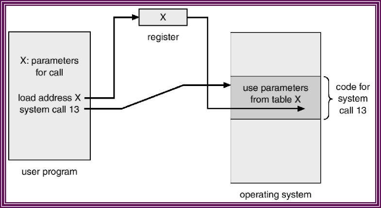

Biasanya tersedia sebagai instruksi bahasa assembly. Beberapa sistem mengizinkan system calls dibuat langsung dari program bahasa tingkat tinggi. Beberapa bahasa pemrograman (contoh: C, C++) telah didefenisikan untuk menggantikan bahasa assembly untuk sistem pemrograman.

Tiga metode umum yang digunakan dalam memberikan parameter kepada sistem operasi: 

- Melalui register. 

- Menyimpan parameter dalam block atau tabel pada memori dan alamat block tersebut diberikan  sebagai parameter dalam register.

- Menyimpan parameter (push) ke dalam stack oleh program, dan melakukan pop off pada stack  oleh sistem operasi

## **Jenis System Call**

- <b>System calls</b> yang berhubungan dengan kontrol proses antara lain ketika penghentian pengeksekusian program. Baik secara normal (end) maupun tidak normal (abort). 
- Selama proses dieksekusi kadang kala diperlukan untuk me-load atau mengeksekusi program lain, disini diperlukan lagi suatu system calls. Juga ketika membuat suatu proses baru dan menghentikan sebuah proses. Ada juga system calls yang dipanggil ketika kita ingin meminta dan merubah atribut dari suatu proses. 
- MS-DOS adalah contoh dari sistem single-tasking. MS-DOS menggunakan metoda yang sederhana dalam menjalankan program aan tidak menciptakan proses baru. Program di-load ke dalam memori, kemudian program dijalankan. Berkeley Unix adalah contoh dari sistem multi-tasking. Command Interpereter masih tetap bisa dijalankan ketika program lain dieksekusi. 

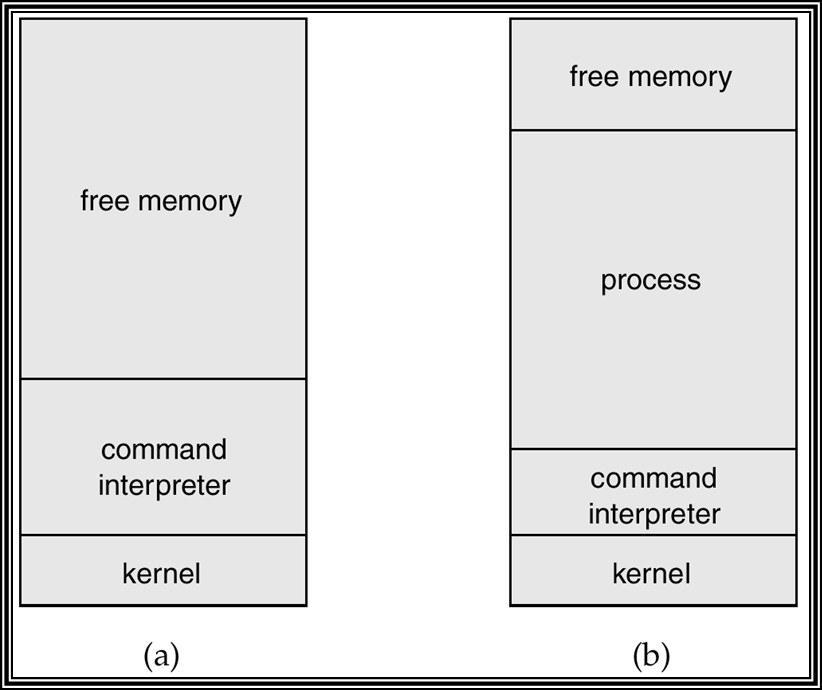

Eksekusi MS-DOS

## **System Call Managemen Berkas**

- System calls yang berhubungan dengan berkas sangat diperlukan. Seperti ketika kita ingin membuat atau menghapus suatu berkas. Atau ketika ingin membuka atau menutup suatu berkas yang telah ada, membaca berkas tersebut, dan menulis berkas itu. System calls juga diperlukan ketika kita ingin mengetahui atribut dari suatu berkas atau ketika kita juga ingin merubah atribut tersebut. Yang termasuk atribut berkas adalah nama berkas, jenis berkas, dan lain-lain. 
- Ada juga system calls yang menyediakan mekanisme lain yang berhubungan dengan direktori atau sistim berkas secara keseluruhan. Jadi bukan hanya berhubungan dengan satu spesifik berkas. Contohnya membuat atau menghapus suatu direktori, dan lain-lain. 

## **System Call Managemen Piranti**

- Program yang sedang dijalankan kadang kala memerlukan tambahan sumber daya. Jika banyak pengguna yang menggunakan sistem, maka jika memerlukan tambahan sumber daya maka harus meminta peranti terlebih dahulu. Dan setelah selesai penggunakannnya harus dilepaskan kembali. Ketika sebuah peranti telah diminta dan dialokasikan maka peranti tersebut bisa dibaca, ditulis, atau direposisi. 

## **System Call Informasi/Pemeliharaan**

- Beberapa system calls disediakan untuk membantu pertukaran informasi antara pengguna dan sistem operasi. Contohnya system calls untuk meminta dan mengatur waktu dan tanggal. Atau meminta informasi tentang sistem itu sendiri, seperti jumlah pengguna, jumlah memori dan disk yang masih bisa digunakan, dan lain-lain. Ada juga system calls untuk meminta informasi tentang proses yang disimpan oleh sistem dan system calls untuk merubah (reset) informasi tersebut. 

## **System Call Komunikasi**

Dua model komunikasi:
- <b>Message-passing</b>. Pertukaran informasi dilakukan melalui fasilitas komunikasi antar proses yang 
disediakan oleh sistem operasi.
- <b>Shared-memory</b>. Proses menggunakan memori yang bisa digunakan oleh berbagai proses untuk pertukaran informasi dengan membaca dan menulis data pada memori tersebut.

Dalam message-passing, sebelum komunikasi dapat dilakukan harus dibangun dulu sebuah koneksi. Untuk itu diperlukan suatu system calls dalam pengaturan koneksi tersebut, baik dalam menghubungkan koneksi tersebut maupun dalam memutuskan koneksi tersebut ketika komunikasi sudah selesai dilakukan. Juga diperlukan suatu system calls untuk membaca dan menulis pesan (message) agar pertukaran informasi dapat dilakukan. 

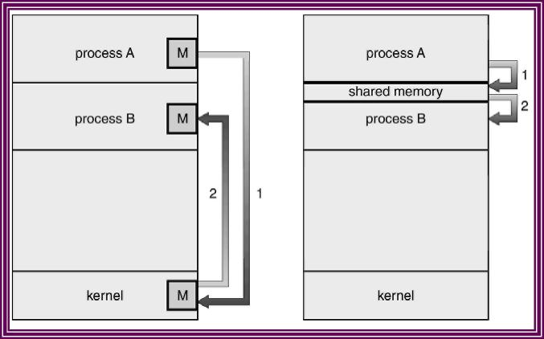

 

# **Contoh Sistem Operasi yang ada pada Laptop Acer Swift 3x**

## **1. Komponen Sistem Operasi**

- **Manajemen Berkas**

<b>Manajemen file berkas</b> adalah jenis perangkat lunak yang mengelola file data dalam sistem komputer. Sistem manajemen file menangani bagaimana file diatur, bukan hanya sekadar mengorganisir cara menyimpan saja. Tetapi digunakan untuk operasi pemeliharaan atau pengaturan file.

1. Lalu bagaimana cara membuat File/Folder?

Untuk step pertama bisa dilihat gambar dibawah, klik folder maka akan muncul Folder baru dan kita diminta memasukan nama folder sesuai yang kita mau.

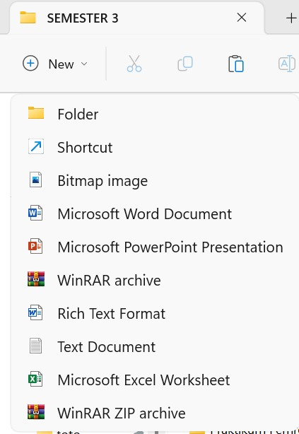

2. Membuat File/Folder

Setelah memberi nama pada folder/file yang baru dibuat,  maka folder tersebut sudah dapat diakses seperti gambar diatas.

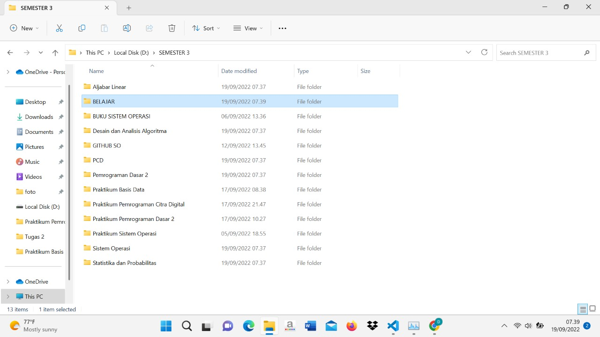

3. Menghapus File/Folder

Langkah berikutnya adalah bagaimana cara menghapus folder yang sudah dibuat tadi. Seperti gambar dibawah cukup klik foldernya lalu dibagian atas akan muncul logo untuk menghapus folder.

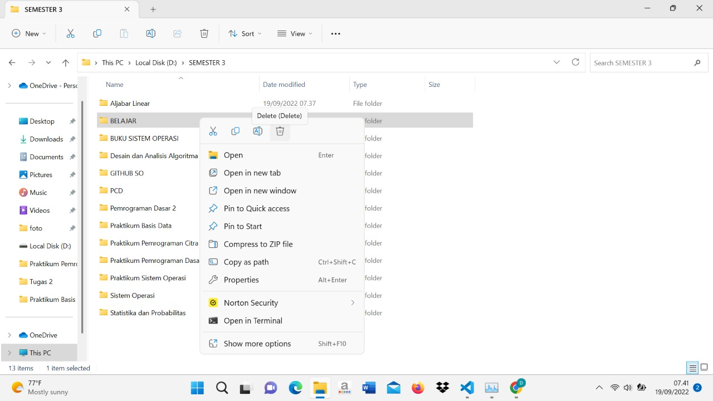

Gambar dibawah adalah hasil dari setelah kita mengklik logo hapus tadi, maka folder sudah berhasil terhapus.

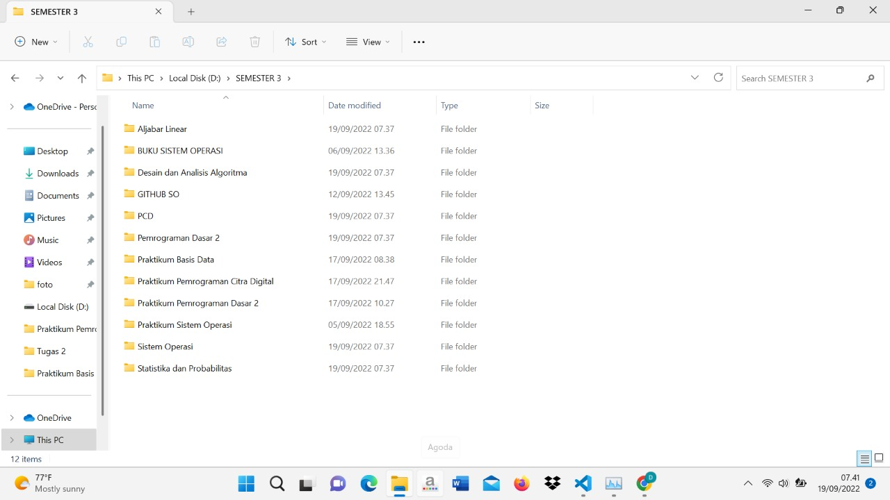

- **Manajemen Proses**

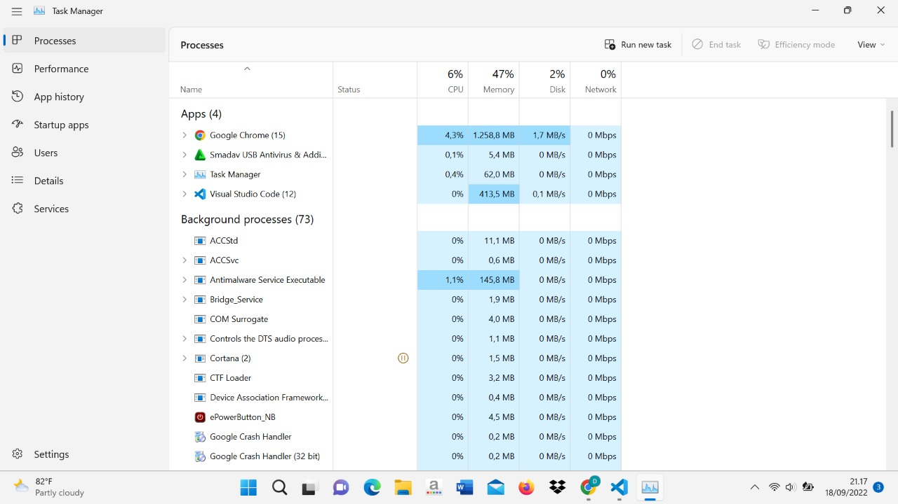

Manajemen proses disini menampilkan software apa saja yang sedang berjalan pada laptop. Contoh software yang sedang berjalan sekarang adalah Google Chrome, Smadav dan Visual Studio Code. Kita bisa melihat berapa persen ruang penggunaan CPU, RAM, Disk yang digunakan pada saat software sedang berjalan.

- **Command Interpreter System**

Command Interpreter adalah suatu program yang membaca perintah berdasarkan teks yang diterima melalui User atau File. Sistem Operasi menunggu instruksi dari pengguna (command driven). Untuk Contohnya disini saya menggunakan CMD dilaptop saya bisa dilihat seperti gambar dibawah.

 
1. Mematikan laptop lewat CMD

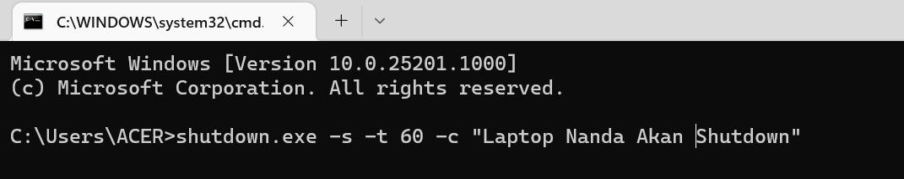

Bisa dilihat seperti gambar diatas shutdown laptop lewat cmd dibutuhkan Code seperti diatas.

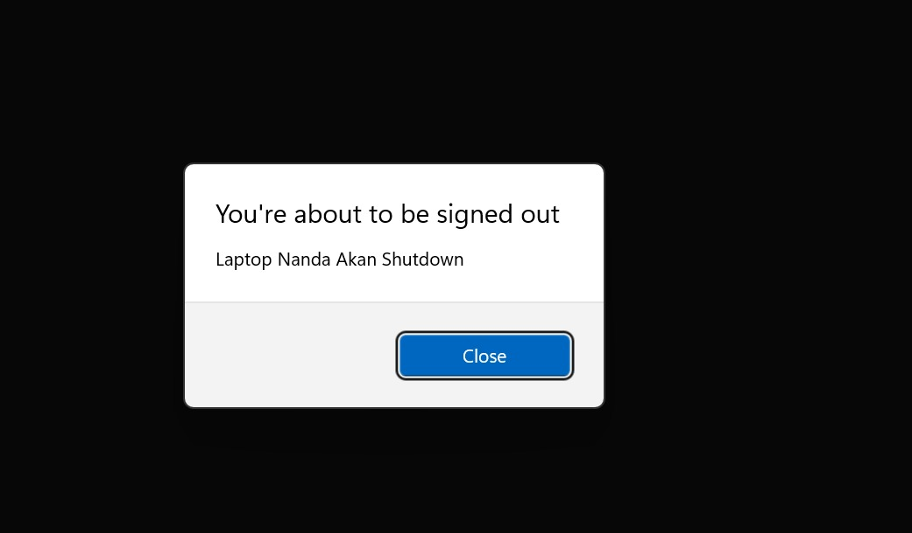

Setelah menekan enter maka akan muncul pop up seperti gambar diatas dan dalam beberapa detik laptop akan shutdown dengan sendirinya.

2. Untuk mencek info sistem laptop dan Alamat mac 

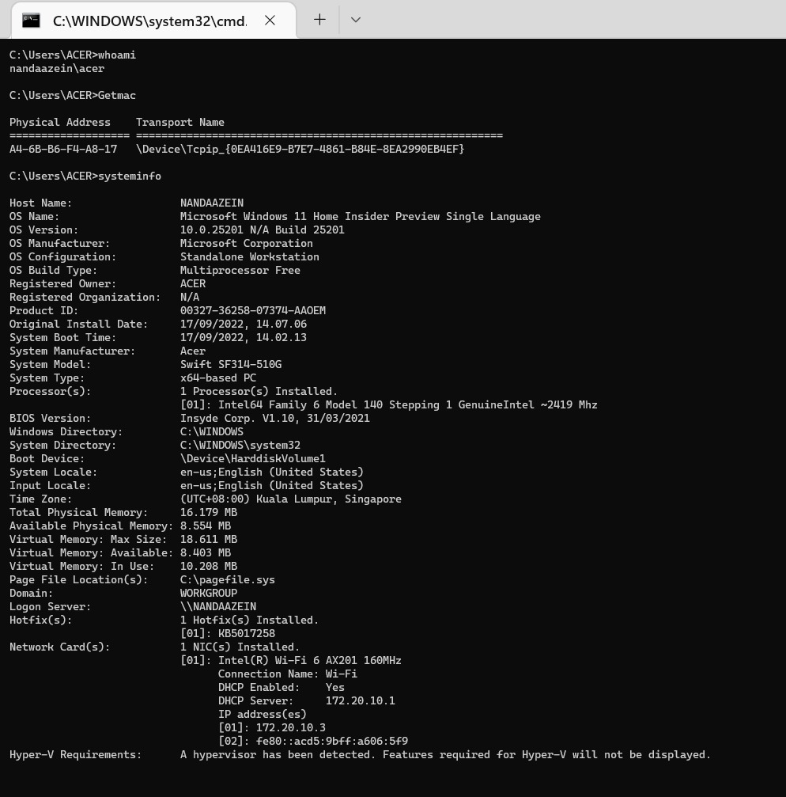

- Mencek Systeminfo

Systeminfo merupakan perintah CMD yang memiliki fungsi untuk menampilkan informasi komputer yang digunakan. Informasi terkait komputer kamu, bisa kamu dapatkan dengan menggunakan perintah tersebut. Cara menggunakannya pun mudah, cukup ketik systeminfo pada CMD kemudian Enter.

- Alamat mac 

Perintah getmac merupakan perintah CMD yang bisa digunakan untuk melihat alamat mac atau alamat fisik dari komputer yang kamu gunakan.
Cara menggunakannya mudah, kamu bisa membuka CMD dan ketikan getmac. Maka akan tampil semua alamat mac dari komputer yang digunakan.

**Sistem I/O**

Berikutnya ada Manajemen Sistem Input/o, Manajemen input output sering disebut sebagai device manager atau penyedia device driver sehingga operasi input output dapat berjalan. Manajemen input output merupakan ruang lingkup atau batasan dalam manajemen perangkat keras input output yaitu bagaimana perangkat keras input output itu dikelola dan diprogram agar dapat berjalan dengan baik. Dalam sistem komputer, manajemen input output sangat diperlukan karena input output adalah sarana user untuk bisa berkomunikasi dengan komputer. Sstem I/O yang sedang berjalan pada laptop sekarang ada Flashdisk, Mouse terlihat seperti gambar dibawah.

## **2. Layanan Sistem Operasi**

- **Pembuatan Program dan Manipulasi Berkas**
 

Sistem operasi menyediakan berbagai fasilitas yang membantu programer dalam membuat program seperti editor. Walaupun bukan bagian dari sistem operasi tetapi layanan ini dapat diakses menggunakan sistem operasi. Contohnya dalam OS Windows tersedia applikasi <b>Notepad</b>.

Dalam Notepad kita dapat membaca dan menulis berkas, dan kadang kala juga harus membuat atau menghapus berkas.

1. Sebagai contoh yang pertama kita dapat menulis dan membuat berkas pada editor Notepad.

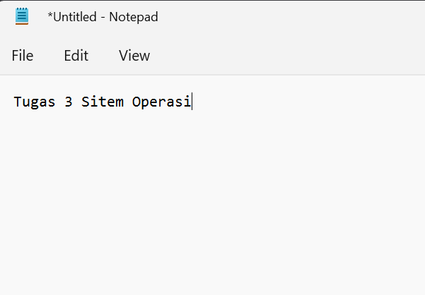

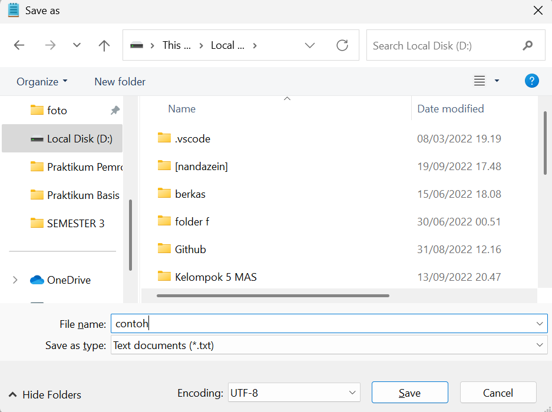

2. Menghapus berkas yang sudah dibuat

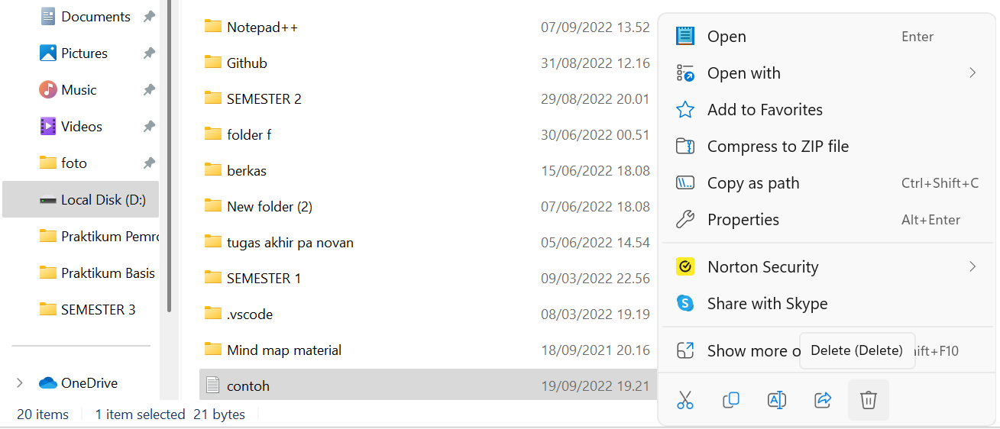

- **Deteksi Error**

Pada saat kita ingin merubah nama file ataupun folder tetapi folder tersebut masih kita jalankan maka akan muncul pop up yang bertuliskan <b>folder in use.</b>

- **Proteksi dan Keamanan**

Proteksi dilakukan oleh sebuah program yang bernama <b>User Account Control</b>. Setiap kali ada pengaksesan sumber daya PC yang diproteksi, sistem pertama kali akan menanyakan reference monitor tentang keabsahan akses tersebut dan kemudian akan menentukan keputusan apakah akses tersebut diperbolehkan atau tidak.

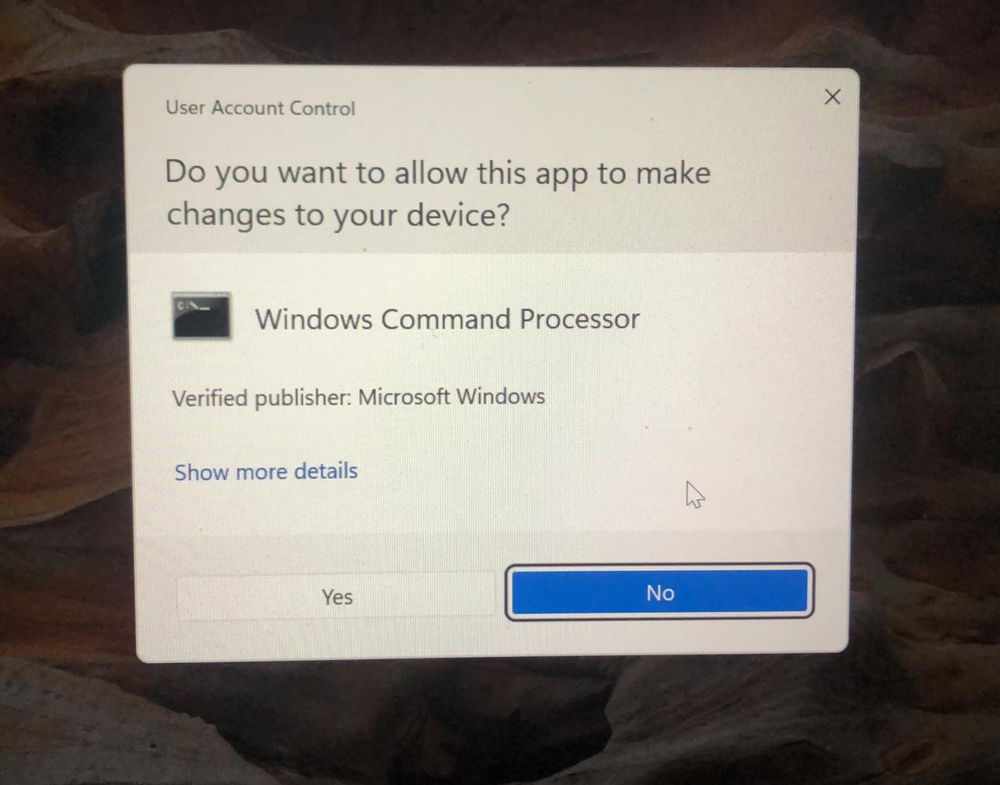

## **3. Sistem Call**

- **Membuat folder baru menggunakan CMD**

Langkah pertama yang harus dilakukan adalah memilih lokasi penyimpanan yang ingin kita gunakan. Disini saya memilih D untuk menyimpan folder yang dibuat.

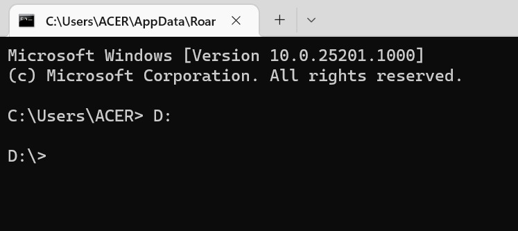

Selanjutnya kita bisa menuliskan perintah <b>mkdir</b> diikuti dengan nama file yang akan dibuat. 

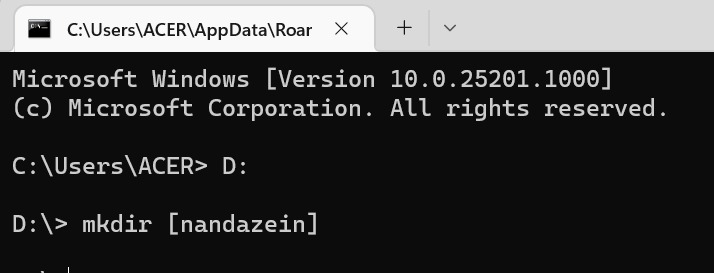

Seteleh menekan enter, maka folder baru yang sudah dibuat tadi sudah berhasil dibuat dan masuk pada penyimpanan D.

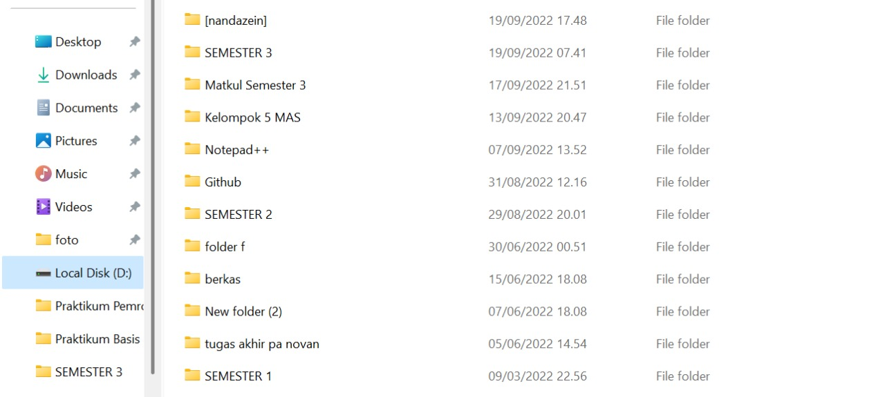

 

- **Membuka applikasi menggunakan CMD**

Untuk membuka atau mengakses software menggunakan CMD kita bisa mengetikan keyword <b>start</b> yang diikuti dengan nama software.

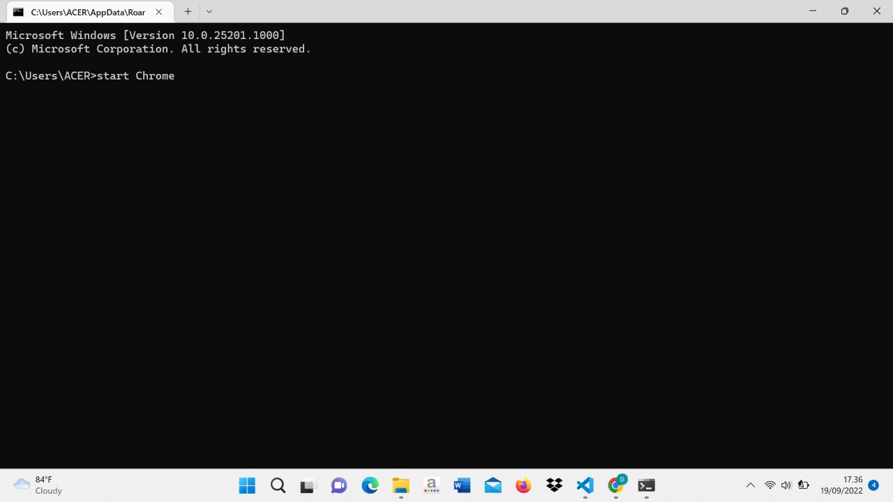

Seteleh mengetikan keywoard dan nama software, langkah selanjutnya adalah menekan tombol enter. Lalu software yang akan dituju dapat diakses.

- **Meminta Informasi**

Yang terakhir, saya memberikan contoh sistem call yang akan menampilkan informasi. Disini saya ingin meminta informasi mengenai space yang digunakan pada penyimpanan D saya dan berapa ruang space yang tersisa atau tidak digunakan. Kita bisa mengklik kanan kemudian pilih <b>properties</b>, selanjutnya sistem yang ada pada laptop kita akan menampilkan informasi mengenai space yang ingin kita ketahui.

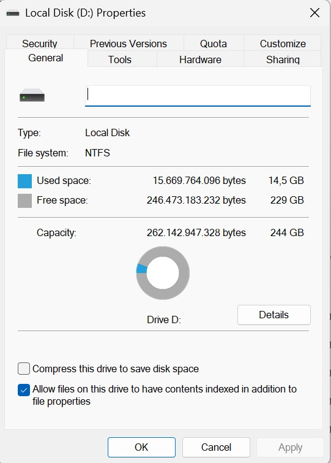

