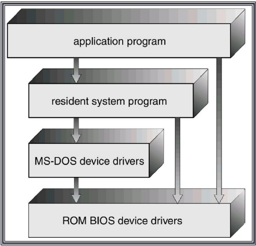

### **Tugas 4 Sistem Operasi**

Difana Nanda Pridhasila Zein

2110131220017

<b>STRUKTUR SISTEM OPERASI</b>

Struktur sistem operasi modern merupakan suatu sistem yang besar dan kompleks sehingga strukturnya harus dirancang dengan hati-hati dan saksama supaya dapat berfungsi seperti yang diinginkan serta dapat dimodifikasi dengan mudah. Struktur sistem operasi merupakan komponen-komponen sistem operasi yang dihubungkan dan dibentuk di dalam kernel.

Terdapat 3 pendekatan/model struktur sistem operasi :

- Struktur sederhana
- Pendekatan berlapis
- Mikrokernel

# **1. Struktur Sederhana**

Struktur sistem operasi di sistem ini tidak terstruktur. Sistem operasi sebagai kumpulan prosedur yang masing-masing dapat saling dipanggil jika dibutuhkan. Setiap prosedur yang ada di dalam sistem ini mempunyai interface yang sudah didefinisikan dengan baik. Dalam hal ini berupa parameter dan hasilnya, serta masing-masing prosedur bebas untuk saling memanggil jika dibutuhkan. Walaupun disebut tidak berstruktur, sebenarnya sistem monilisthic tetap mempunyai struktur walaupun kecil dan mendasar.

Contoh sistem operasi yang memiliki struktur sederhana adalah MS-DOS dan UNIX.

## **1. MS-DOS**

<i>Lapisan Struktur MS-DOS</i>

Ada sejumlah sistem komersial yang tidak memiliki struktur yang cukup baik.
Sistem operasi tersebut sangat kecil, sederhana dan memiliki banyak keterbatasan. Salah
satu contoh sistem tersebut adalah MS-DOS. MS-DOS dirancang oleh orang-orang yang
tidak memikirkan akan kepopuleran software tersebut. Sistem operasi tersebut terbatas
pada perangkat keras sehingga tidak terbagi menjadi modul-modul.

MS-DOS bersifat <b>single mode</b> yaitu tanpa proteksi perangkat keras. Dalam MS-DOS, perintah internal telah dimasukkan ke dalam command.com (interpreter perintah DOS), sehingga dapat langsung dieksekusi oleh kernel DOS dimana saja. Sedangkan perintah eksternal tidak dimasukkan ke dalam command.com, ini berarti dibutuhkan sebuah berkas yang dapat dieksekusi (berupa program DOS) yang harus terdapat dalam direktoriaktif. Berikut merupakan lapisan struktur MS-DOS.

Meskipun MS-DOS mempunyai beberapa struktur, antar muka dan tingkatan fungsionalitas tidak terpisah
secara baik. Karena Intel 8088 tidak menggunakan dual-mode sehingga tidak ada proteksi hardware. Oleh karena itu orang mulai enggan menggunakannya. 

## **2. UNIX**

<i>Struktur Sistem UNIX</i>

Sistem operasi UNIX (Original UNIX) juga terbatas pada fungsi perangkat
keras dan struktur yang terbatas. UNIX hanya terdiri atas 2 bagian, yaitu Kernel dan
program sistem. Kernel berada di bawah tingkat antarmuka system call dan diatas
perangkat lunak secara fisik. Kernel ini berisi sistem file, penjadwalan CPU,
menejemen memori, dan fungsi sistem operasi lainnya yang ada pada sistem call berupa
sejumlah fungsi yang besar pada satu level. Program sistem meminta bantuan kernel
untuk memanggil fungsi-fungsi dalam kompilasi dan manipulasi file.

## **Kelebihan dan Kekurangan Struktur Sederhana**

Kelebihan :
- Layanan dapat dilakukan sangat cepat karena terdapat di satu ruang alamat.

Kekurangan :
- Pengujian dan penghilangan kesalahan sulit karena tidak dapat dipisahkan dan dilokalisasi.

- Sulit dalam menyediakan fasilitas pengamanan.

- Merupakan pemborosan bila setiap komputer harus menjalankan kernel monolitik sangat besar sementara sebenarnya tidak memerlukan seluruh layanan yang disediakan kernel.

- Tidak fleksibel.

- Kesalahan pemograman satu bagian dari kernel menyebabkan matinya seluruh sistem

# **STRUKTUR BERLAPIS**

<i>Struktur Berlapis</i>

Sistem operasi dibentuk secara hirarki berdasar lapisan-lapisan, dimana 
lapisan-lapisan bawa memberi layanan lapisan lebih atas. Lapisan yang paling bawah adalah perangkat keras, dan yang paling tinggi adalah user-interface. Sebuah lapisan adalah implementasi dari obyek abstrak yang  merupakan enkapsulasi dari data dan operasi yang bisa memanipulasi data 
tersebut. Struktur berlapis dimaksudkan untuk mengurangi kompleksitas rancangan dan implementasi sistem operasi. Tiap lapisan mempunyai 
fungsional dan antarmuka masukan-keluaran antara dua lapisan 
bersebelahan yang terdefinisi bagus.

Sedangkan menurut <b>Tanenbaum dan Woodhull</b>, sistem terlapis terdiri dari enam lapisan, yaitu:

- <b>Lapis 5</b> – The operator
Berfungsi untuk pemakai operator.

- <b>Lapis 4</b> – User programs
Berfungsi untuk aplikasi program pemakai.

- <b>Lapis 3</b> – I/O management
Berfungsi untuk menyederhanakan akses I/O pada level atas.

- <b>Lapis 2</b> - Operator-operator communication
Berfungsi untuk mengatur komunikasi antar proses.

- <b>Lapis 1</b> - Memory and drum management
Berfungsi untuk mengatur alokasi ruang memori atau drum magnetic.

- <b>Lapis 0</b> - Processor allocation and multiprogramming
Berfungsi untuk mengatur alokasi pemroses dan switching, multi 
programming dan pengaturan prosessor.

Menurut <b>Stallings</b>, model tingkatan sistem operasi yang mengaplikasikan 
prinsip ini dapat dilihat pada tabel berikut, yang terdiri dari level-level dibawah 
ini:

- <b>Level 1</b>

Terdiri dari sirkuit elektronik dimana obyek yang ditangani adalah register 
memory cell, dan gerbang logika. Operasi pada obyek ini seperti 
membersihkan register atau membaca lokasi memori.</b>

- <b>Level 2</b>

Pada level ini adalah set instruksi pada prosesor. Operasinya adalah instruksi 
bahasa-mesin, seperti menambah, mengurangi, load dan store.

- <b>Level 3</b>

Tambahan konsep prosedur atau subrutin ditambah operasi call atau return.

- <b>Level 4</b>

Mengenalkan interupsi yang menyebabkan prosesor harus menyimpan 
perintah yang baru dijalankan dan memanggil rutin penanganan interupsi. 
Empat level pertama bukan bagian sistem operasi tetapi bagian perangkat 
keras. Meski pun demikian beberapa elemen sistem operasi mulai tampil 
pada level-level ini, seperti rutin penanganan interupsi. Pada level 5, kita 
mulai masuk kebagian sistem operasi dan konsepnya berhubungan dengan 
multi-programming.

- <b>Level 5</b>

Level ini mengenalkan ide proses dalam mengeksekusi program. Kebutuhan-kebutuhan dasar pada sistem operasi untuk mendukung proses ganda 
termasuk kemampuan men-suspend dan me-resume proses. Hal ini 
membutuhkan register perangkat keras untuk menyimpan agar eksekusi bisa 
ditukar antara satu proses ke proses lainnya.

- <b>Level 6</b>

Mengatasi penyimpanan sekunder dari komputer. Level ini untuk 
menjadualkan operasi dan menanggapi permintaan proses dalam 
melengkapi suatu proses.

- <b>Level 7</b>

Membuat alamat logik untuk proses. Level ini mengatur alamat virtual ke 
dalam blok yang bisa dipindahkan antara memori utama dan memori 
tambahan. Cara-cara yang sering dipakai adalah menggunakan ukuran 
halaman yang tetap, menggunakan segmen sepanjang variabelnya, dan 
menggunakan cara keduanya. Ketika blok yang dibutuhkan tidak ada 
dimemori utama, alamat logis pada level ini meminta transfer dari level 6. 
Sampai point ini, sistem operasi mengatasi sumber daya dari prosesor 
tunggal. Mulai level 8, sistem operasi mengatasi obyek eksternal seperti 
peranti bagian luar, jaringan, dan sisipan komputer kepada jaringan.

- <b>Level 8</b>

Mengatasi komunikasi informasi dan pesan-pesan antar proses. Dimana 
pada level 5 disediakan mekanisme penanda yang kuno yang memungkinkan 
untuk sinkronisasi proses, pada level ini mengatasi pembagian informasi 
yang lebih banyak. Salah satu peranti yang paling sesuai adalah pipe (pipa) 
yang menerima output suatu proses dan memberi input ke proses lain.

- <b>Level 9</b>

Mendukung penyimpanan jangka panjang yang disebut dengan berkas. Pada 
level ini, data dari penyimpanan sekunder ditampilkan pada tingkat abstrak, 
panjang variabel yang terpisah. Hal nini bertentangan tampilan yang 
berorientasikan perangkat keras dari penyimpanan sekunder.

- <b>Level 10</b>

Menyediakan akses ke peranti eksternal menggunakan antarmuka standar.

- <b>Level 11</b>

Bertanggung-jawab mempertahankan hubungan antara internal dan eksternal 
identifier dari sumber daya dan obyek sistem. Eksternal identifier adalah 
nama yang bisa dimanfaatkan oleh aplikasi atau pengguna. Internal identifier 
adalah alamat atau indikasi lain yang bisa digunakan oleh level yang lebih 
rendah untuk meletakkan dan mengontrol obyek.

- <b>Level 12</b>

Menyediakan suatu fasilitator yang penuh tampilan untuk mendukung proses. 
Hal ini merupakan lanjutan dari yang telah disediakan pada level 5. Pada 
level 12, semua info yang dibutuhkan untuk managemen proses dengan 
berurutan disediakan, termasuk alamat virtual di proses, daftar obyek dan 
proses yang berinteraksi dengan proses tersebut serta batasan interaksi 
tersebut, parameter yang harus dipenuhi proses saat pembentukan, dan 
karakteristik lain yang mungkin digunakan sistem operasi untuk mBerfungsi 
untuk mengatur alokasi ruang memori atau drum magnetic.
Lapis 0 -Processor allocation and multiprogramming
Berfungsi untuk mengatur alokasi pemroses dan switching, multi 
programming dan pengaturan prosessor.

- <b>Level 13</b>

Menyediakan antarmuka dari sistem operasi dengan pengguna yang 
dianggap sebagai shell atau dinding karena memisahkan pengguna dengan 
sistem operasi dan menampilkan sistem operasi dengan sederhana sebagai 
kumpulan servis atau pelayanan.

Dapat <b>disimpulkan</b> bahwa lapisan sistem operasi 
secara umum terdiri atas 4 bagian, yaitu:

<b>1. Perangkat Keras</b>

Lebih berhubungan kepada perancang sistem. Lapisan ini mencakup lapisan 0 dan 1 menurut Tanenbaum, dan level 1 sampai dengan level 4 menurut Stallings

<b>2. Sistem Operasi</b>

Lebih berhubungan kepada programer. Lapisan ini mencakup lapisan 2 menurut Tanenbaum, dan level 5 sampai dengan level 7 menurut Stallings.

<b>3. Kelengkapan</b>

Lebih berhubungan kepada programer. Lapisan ini mencakup lapisan 3 menurut Tanenbaum, dan level 8 sampai dengan level 11 menurut Stallings.

<b>4. Program Aplikasi</b>

Lebih berhubungan kepada pengguna aplikasi komputer. Lapisan ini  mencakup lapisan 4 dan lapisan 5 menurut Tanebaum, dan level 12 dan level 13 menurut Stallings.

<h2><b>Contoh</b></h2> 
sistem operasi yang menggunakan Struktur ini adalah :

<b>1. THE (Technische Hogeschool at Eindhoven)</b>

Desain sistem multiprograming THE signifikan untuk penggunaan struktur berlapis, di mana lapisan “lebih tinggi” hanya bergantung pada lapisan “lebih rendah” :

- Lapis-5 : user program

- Lapis-4 : buffering untuk I/O device

- Lapis-3 : operator-console device driver

- Lapis-2 : menejemen memori

- Lapis-1 : penjadwalan CPU

- Lapis-0 : hardware

<b>2. MULTICS</b>

Multiplexed Information and Computing System atau biasa disingkat MULTICS adalah Sebuah Sistem Operasi yang digunakan pada komputer-komputer mainframe untuk keperluan server jaringan. Pada tahun tahun 1965, MULTICS merupakan satu–satunya Sistem Operasi dengan fasilitas sistem multi user.

Pengembangan MULTICS adalah hasil kerjasama antara Bell Telephone Labs dan MIT. Dua orang staf pengembang perangkat lunak di Bell labs, yakni Ken Thompson dan Dennis Ritchie yang juga pembuat bahasa pemrograman C adalah orang–orang penting dalam proyek MULTICS. Dan software yang pertama kali mereka buat adalah game multi user yang dikenal dengan nama Space Travel. Kemudian berselang beberapa tahun, munculah Unix sebagai pengembangan dari MULTICS.

## **Kelebihan dan Kekurangan Struktur Berlapis**
Kelebihan :

- Memiliki rancangan modular, yaitu sistem dibagi menjadi beberapa modul 
& tiap modul dirancang secara independen.

- Pendekatan berlapis menyederhanakan rancangan, spesifikasi dan 
implementasi sistem operasi.

- Mempermudah debug dan verifikasi sistem.

- Lapisan pertama bisa didebug tanpa mengganggu sistem yang lain karena hanya menggunakan perangkat keras dasar untuk implementasi fungsinya.

Kekurangan :

- Fungsi-fungsi sistem operasi diberikan ke tiap lapisan secara hati-hati.
Contoh: Sistem operasi yang menggunakan pendekatan berlapis adalah 
THE yang dibuat oleh Djikstra dan mahasiswa-mahasiswanya, serta sistem 
operasi MULTICS.

# **Mikro Kernel**

Mikrokernel adalah inti OS kecil yang menyediakan dasar untuk modular extensesi. Metode ini menyusun sistem operasi dengan menghapus semua komponen yang tidak esensial dari kernel, dan mengimplementasikannya sebagai program sistem pada level pengguna. Hasilnya kernel yang lebih kecil. Pada umumnya mikrokernel mendukung proses dan menagemen memori yang minimal, sebagai tambahan untuk fasilitas komunikasi.

Fungsi utama mikrokernel adalah mendukung fasilitas komunikasi antara program klien dan bermacam-macam layanan yang juga berjalan di user space. Komunikasi yang dilakukan secara tidak langsung didukung oleh sistem message passing dengan bertukar pesan melalui mikrokernel.

Salah satu keuntungan mikrokernel adalah ketika layanan baru akan ditambahkan ke user space, kernel tidak perlu dimodifikasi. Kalau pun harus, perubahan akan lebih sedikit. Hasil sistem operasinya lebih mudah untuk ditempatkan pada suatu desain perangkat keras ke desain lainnya. Mikrokernel juga mendukung keamanan reliabilitas lebih, karena kebanyakan layanan berjalan sebagai pengguna proses. Jika layanan gagal, sistem operasi lainnya tetap terjaga.

<i>Struktur Mikrokernel</i></b>

Dalam teorinya, sistem operasi yang menggunakan microkernel disebut jauh lebih stabil dibandingkan dengan monolithic kernel, karena sebuah server yang gagal bekerja, tidak akan menyebabkan kernel menjadi tidak dapat berjalan, dan server tersebut akan dihentikan oleh kernel utama. Akan tetapi, dalam prakteknya, bagian dari system state dapat hilang oleh server yang gagal bekerja tersebut, dan biasanya untuk melakukan proses eksekusi aplikasi pun menjadi sulit, atau bahkan untuk menjalankan server-server lainnya. Sistem operasi yang menggunakan microkernel umumnya secara dramatis memiliki kinerja di bawah kinerja sistem operasi yang menggunakan monolithic kernel. Hal ini disebabkan oleh adanya overhead yang terjadi akibat proses input/output dalam kernel yang ditujukan untuk mengganti konteks (context switch) untuk memindahkan data antara aplikasi dan server. 

Beberapa sistem operasi yang menggunakan microkernel:

## **Symbian OS**

Symbian OS merupakan sebuah sistem operasi yang populer digunakan pada handphone, handheld device, embedded device, dan PDA Phone. Sistem operasi ini dikembangkan oleh Symbian Ltd yang dirancang untuk digunakan peralatan melakukan usaha (mobile). Symbian OS memiliki arsitektur mikrokernel, yang membedakannya dari sistem operasi seperti Microsoft Windows dan Linux. Dalam Symbian OS, layanan inti yang akan berada di dalam kernel dalam sistem operasi monolitik dipindahkan ke luar. Penggunaan arsitektur client-server yang meluas, dan perlindungan kode sistem dari klien yang mengikutinya, menjamin ketahanan dan ketersediaan tinggi dari layanan ini. Tujuannya adalah sistem yang kuat yang juga responsif dan dapat diperluas.

## **MAC OS**

Mac OS adalah sistem operasi yang menggunakan kernel BSD sehingga beberapa kalangan mengatakan bahwa Mac OS X termasuk dalam keluarga Unix. Kernel Mac OS mengusung metode struktur ini untuk menghilangkan komponen-komponen yang tidak diperlukan dari kernel dan mengimplementasikannya sebagai sistem dan program-program level user. Hal ini akan menghasilkan kernel yang kecil. Fungsi utama dari jenis ini adalah menyediakan fasilitas komunikasi antara program client dan bermacam pelayanan yang berjalan pada ruang user.

## **Kelebihan dan Kekurangan Mikrokernel**

Kelebihan : 

- **Interface** yang seragam. Proses tidak lagi dibedakan, baik antara kernel-level maupun user-level, karena semuanya berkomunikasi via message passing.

- **Extensibility**. Bisa menambahkan fitur-fitur baru tanpa perlu melakukan kompilasi ulang

- **Flexibility**. Fitur-fitur yang sudah ada bisa dikurangi, atau dimodifikasi sesuai dengan kebutuhan sehingga menjadi lebih efisien. Misalnya tidak semua pengguna membutuhkan security yang sangat ketat, atau kemampuan untuk melakukan distributed computing.

- **Portability**. Pada mikro kernel, semua atau sebagian besar kode yang prosesor-spesifik berada di dalamnya. Jadi, proses porting ke prosesor lain bisa dilakukan dengan relatif sedikit usaha. Pada kelompok desktop misalnya, tampaknya dominasi Intel makin kuat. Tapi, sampai seberapa lama itu bisa bertahan? Karena itulah, portability adalah salah satu isu yang sangat penting.

- **Reliability**. Semakin besar suatu software, maka tentulah semakin sulit untuk menjamin reliabilitynya. Desain dengan pendekatan berlapis sangatlah membantu, dan dengan pendekatan mikro kernel bisa lebih lagi. Mikro kernel dapat diuji secara ekstensif karena dia menggunakan API yang sedikit,sehingga bisa meningkatkan kualitas code di luar kernel.

- **Support for object-oriendted OS**. Model mikro kernel sangat sesuai untuk mengembangkan sistem operasi yang berbasis object-oriented. Contoh sistem operasi yang menggunakan mikro kernel adalah Mac OS X dan QNX.

Kekurangan :

- Kinerja akan berkurang selagi bertambahnya fungsi-fungsi yang digunakan

## **Kesimpulan**

- **Struktur Sederhana**

Struktur sederhana atau monolitik merupakan struktur sistem operasi yang tidak terstruktur. Sistem operasi ini sebagai kumpulan prosedur yang masing-masing dapat saling dipanggil jika dibutuhkan. Setiap prosedur yang ada di dalam sistem ini mempunyai interface yang sudah didefinisikan dengan baik, dikarenakan semua layanan terdapat <b>didalam satu ruang</b> (satu baris memanjang) keuntungan yang didapat dalam menggunakan struktur ini adalah semua layanan yang dipanggil dapat dilakukan dengan cepat.

- **Strukur Berlapis**

Struktur berlapis merupakan sistem operasi dipecah menjadi beberapa lapisan (tingkat), struktur ini tersusun dari beberapa lapisan yang <b>saling bertumpuk</b>. Lapisan bawah (lapisan 0) merupakan perangkat keras dan yang tertinggi (lapisan N) merupakan antarmuka pengguna. Lapisan sistem operasi adalah implementasi dari objek abstrak yang dibuat data dan operasi yang dapat memanipulasi data tersebut. Keuntungan utama dari pendekatan berlapis adalah kesederhanaan konstruksi dan debugging.

- **Mikrokernel**

Mikrokernel merupakan metode menyusun sistem operasi dengan menghapus semua komponen yang tidak penting dari kernel dan mengimplementasikannya sebagai sistem dan program tingkat pengguna. Berfungsi untuk menyediakan komunikasi antara program klien dan berbagai layanan yang juga berjalan di ruang pengguna. Komunikasi diberikan melalui penyampaian pesan. Manfaat dari pendekatan mikrokernel adalah membuat perluasan sistem operasi lebih mudah

## **Perbedaan**
- Struktur Sederhana : tidak terstruktur dan berada dalam satu ruang yang sama.

- Struktur Berlapis : lebih terstrukur karena semua fungsi mempunyai bagiannya dan dapat berdiri sendiri.

- Mikrokernel : lebih baik dari struktur sederhana dan berlapis, lebih stabil dan lebih efisien dalam penggunaannya.

